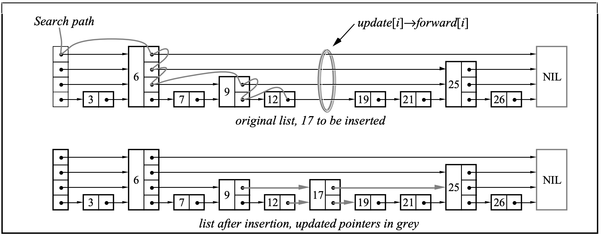

# skiplist
 Implementation of skiplist in cpp

  

Done:

- [x] insert	# insert an element
- [x] erase	# remove an element 
- [x] contains	# check if an element in list
- [x] size	# nums of elements
- [x] empty  # if list is empty
- [x] operator[]  # get or change value 

Todo:

- [ ] save	# save data to disk
- [ ] load	# load data from disk
- [ ] clear	# clear all elements
- [ ] lock    # multithreading
- [ ] logopen    # open or close log

## References

1. [Skip Lists: A Probabilistic Alternative to Balanced Trees](https://15721.courses.cs.cmu.edu/spring2018/papers/08-oltpindexes1/pugh-skiplists-cacm1990.pdf)
2. [Skip list - Wikipedia](https://en.wikipedia.org/wiki/Skip_list)

